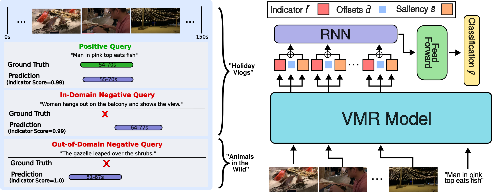
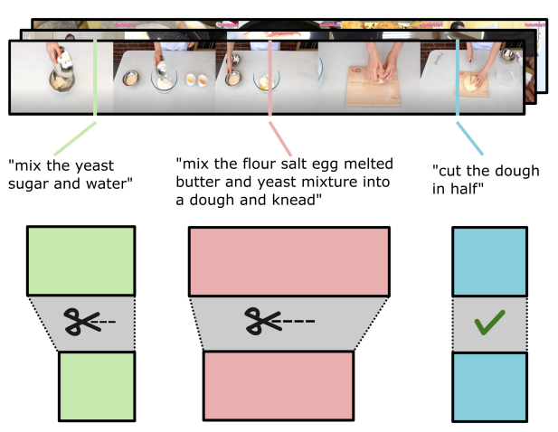
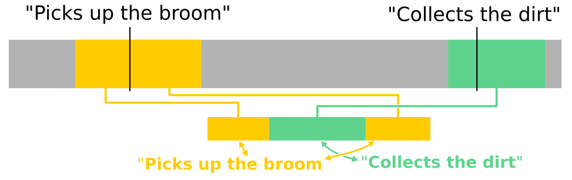

<b>Bio</b>

I am a PhD Student in Computer Vision in the University of Bristol supervised by Dr. Michael Wray and Prof. Dima Damen. My work is mainly in video-language understanding and egocentric vision. Previously I completed a Research Masters in University College Dublin using AI and computer vision techniques for high energy astrophysics.
 

## Publications
{: width="300" }{: .align-left}
<b>Moment of Untruth: Dealing with Negative Queries in Video Moment Retrieval</b> 
<b>Kevin Flanagan</b>, Dima Damen, Michael Wray 
<i>WACV 2025</i>
[[Webpage]](https://keflanagan.github.io/Moment-of-Untruth) [[ArXiv]](https://arxiv.org/abs/2502.08544) [[Code]](https://github.com/keflanagan/MomentofUntruth)
{:style="clear: left"}
{: width="330" }{: .align-left} <b>HD-EPIC: A Highly-Detailed Egocentric Video Dataset</b> Toby Perrett, Ahmad Darkhalil, Saptarshi Sinha, Omar Emara, Sam Pollard, Kranti Parida, Kaiting Liu, Prajwal Gatti, Siddhant Bansal, <b>Kevin Flanagan</b>, Jacob Chalk, Zhifan Zhu, Rhodri Guerrier, Fahd Abdelazim, Bin Zhu, Davide Moltisanti, Michael Wray, Hazel Doughty, Dima Damen 
[[Webpage]](https://hd-epic.github.io) [[ArXiv]](https://arxiv.org/abs/2502.04144)
{:style="clear: left"}
{: width="300" }{: .align-left}
<b>Video Editing for Video Retrieval</b> 
Bin Zhu, <b>Kevin Flanagan</b>, Adriano Fragomeni, Michael Wray, Dima Damen 
<i>ECCV 2024 Workshop on Assistive Computer Vision and Robotics</i>
[[ArXiv]](https://arxiv.org/abs/2402.02335)
{:style="clear: left"}
{: width="300" }{: .align-left}
<b>Learning Temporal Sentence Grounding From Narrated EgoVideos</b> 
<b>Kevin Flanagan</b>, Dima Damen, Michael Wray 
<i>BMVC 2023</i>
[[Webpage]](https://keflanagan.github.io/CliMer-TSG) [[ArXiv]](https://arxiv.org/abs/2310.17395) [[Code]](https://github.com/keflanagan/CliMer)
{:style="clear: left"}
